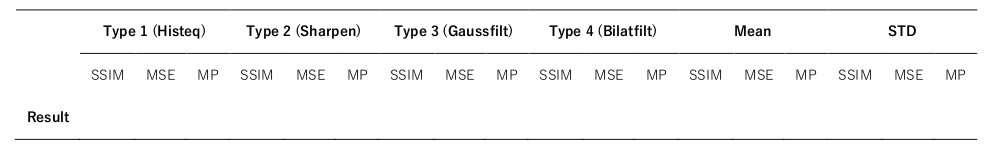

# Computer Vision course assignemts

## **1. Image Fundamentals**
 

### 1.1. Geometric Transformation

 

&nbsp;&nbsp;&nbsp;&nbsp;**1.1.1.** You are given two pictures of the same scene, taken at different times. To align the two pictures, you need to find a mapping function between the two pictures based on some common feature points. Suppose you wereable to extract N (N >= 3) feature points in both images that correspond to the same set of object features, with image coordinates given as (u k , v k ) and (x k , y k ), k = 1,2, ... , N. Also, suppose you want to use an affine mapping to approximate the actual unknown mapping function. How would you determine the affine mapping parameters?

&nbsp;&nbsp;&nbsp;&nbsp;**1.1.2.** Suppose you want to make a panoramic picture of a wide landscape out of two separately captured pictures with a certain overlap. Propose and implement an algorithm for stitching up the two images to make a panorama. List the steps involved; Also, discuss and display the results (Test image Car1&2).

&nbsp;&nbsp;&nbsp;&nbsp;**1.1.3.** Write a program that implements rotation (with interpolation) of an image by a certain angle (30 ° , 45 ° , 80 ° ), and apply it to Elaine image. The rotation center should be the image center.

 

### 1.2. Quantization & Interpolation
 

&nbsp;&nbsp;&nbsp;&nbsp;**1.2.1.** For two cases as without and with histogram equalization (uniform histogram), display the quantized image in (8, 16, 32, 64, 128) Levels and its histograms. Also, the optimum mean square error obtained for each case. Discuss and report the results for the gray Barbara image. It should be noted, you can use rgb2gray, histeq and immse functions for this problem.

| | Report MSE | | | | | |
|--|--|--|--|--|--|--|
| Level | | 8 | 16 | 32 | 64 | 128 |
| Without Histeq | | | | | |
| With Histeq | | | | | |

&nbsp;&nbsp;&nbsp;&nbsp;**1.2.2.** Write a program which can, firstly, downsample an image by a factor of 2, with and without using the averaging filter, and also, up-sample the previously downsampled images by a factor of 2, using the pixel replication and bilinear interpolation methods, respectively. Display (zoom of image) and discuss the results obtained with different methods for the Goldhill image. Note, you can use immse function for this problem.

| | | Report MSE | | | | | |
|--|--|--|--|--|--|--|--|
|  | Pixel Replication | | Bilinear Interpolation |
| Averaging | | | | | |
| Remove Row&Column | | | | | |

 

## **2. Contrast Adjustment**
 

### **2.1. Histogram Equalization**
 

&nbsp;&nbsp;&nbsp;&nbsp;**2.1.1.** Write a program that can compute the histogram of a grayscale image (assuming 256 levels of gray). In a separate main program, apply the program to Camera Man image, and illustrate the histogram as a stem plot besides the test image (using “subplot” function).

&nbsp;&nbsp;&nbsp;&nbsp;**2.1.2.** Write a program that performs histogram equalization on Camera Man image. Display the original and equalized images, as well as their corresponding histograms, all in one figure as mentioned in 2.1.1.

&nbsp;&nbsp;&nbsp;&nbsp;**2.1.3.** What is the difference between histeq and imadjust functions in Matlab? Play with these functions with various input parameters for Camera Man image. Write down your observations in your report and display results.
 
 

### **2.2. Local Histogram Equalization**
 

&nbsp;&nbsp;&nbsp;&nbsp;**2.2.1.** Implement a local histogram equalization with different windows size for the HE1,2,3, and 4 images. Explain and
display the results. Discuss the effects of increasing window size and compare it with global histogram
equalization in detail.

## **3. Filters**
 

### **3.1. Box Filter**
 

&nbsp;&nbsp;&nbsp;&nbsp;**3.1.1.** *Why are box filters bad smoothing filters? List all reasons.

&nbsp;&nbsp;&nbsp;&nbsp;**3.1.2.** *Do the bad features improve if apply the filters several times?

&nbsp;&nbsp;&nbsp;&nbsp;**3.1.3.** What is the resulting filter if apply the 3 × 3 box filter many times? (Test on grayscale Lena Image).

 
 

### **3.2. Median Filter**
 

&nbsp;&nbsp;&nbsp;&nbsp;**3.2.1.** Write a program that can, first, add salt-and-pepper noise to an image with a specified noise density. Try different
noise density (0.05, 0.1, 0.2). Then, perform median filtering with a specified window size. Consider only the median filter with a square shape. For each density, discuss the effect of filtering with different window sizes (3, 5, 7, 9) and experimentally determine the best window size. Note: you can use imnoise and immse functions to generate noisy images and compare the quality of images, respectively. Also, you can ignore the boundary problem by only performing the filtering for the pixels inside the boundary. (Test on grayscale Lena Image).

| | Report MSE | | | | | 
|--|--|--|--|--|--|
| <i>ρ = 0.05</i>| | 3 × 3 | 5 × 5 | 7 × 7 | 9 × 9 |
| <i>ρ = 0.1</i> | | | | |
| <i>ρ = 0.2</i> | | | | |

&nbsp;&nbsp;&nbsp;&nbsp;**3.2.2.** Create a program for adding Gaussian noise with different variance and filtering using average and median filter, respectively. Apply the averaging filter and the median filter to an image with Gaussian noise (with a chosen noise variance). Discuss the effectiveness of each filter on this type of noise. Note: You can use <u>imnoise</u> and
<u>immse</u> functions to generate noisy images and compare the quality of images, respectively. (Test on grayscale Lena Image).

| |  | | | | | Report MSE | | | | | |
|--|--|--|--|--|--|--|--|--|--|--|--|
| | | | **Median** | | | | | **Box Filter** | | |
| <i>ρ = 0.01</i>| | 3×3 | 5×5 | 7×7 | 9×9 | | 3×3 | 5×5 | 7×7 | 9×9
| <i>ρ = 0.05</i> | | | | |
| <i>ρ = 0.1</i> | | | | |

### **3.3. Sharpening, Blurring, and Noise Removal**
 

 &nbsp;&nbsp;&nbsp;&nbsp;**3.3.1.** Take blurry and noisy images (shooting in low light is a good way to get both) by your cellphone and try to improve their appearance and legibility. Display and discuss the results before and after improving.

 

### **3.4. Edge Detection**
 

&nbsp;&nbsp;&nbsp;&nbsp;**3.4.1.** These are often used first-order difference filters in x-direction:

Compare and describe the properties of the three filters; In the following discuss the efficiency of filters for edge detection problems. Are these filters suitable for computing the 2-D gradient? (Test on grayscale Lena Image).

&nbsp;&nbsp;&nbsp;&nbsp;**3.4.2.** Robert suggested the filter to compute the 2-D gradient and to detect edges.

First, in which directions do these filters detect edges? Second, compare the quality of this filter with the filter from previous steps. (Test on grayscale Lena Image).

### **3.5. Unsharp Masking**
 

&nbsp;&nbsp;&nbsp;&nbsp;**3.5.1.** A simple unsharp masking filter has the following form:

where α ∈ [0, 1] represents the threshold step of strength sharpening and I ′ is smoothed version of I which obtained using different filter sizes based on the gaussian filter. Compare and discuss the results for different filter sizes (3, 5, 7, 9) and α for the grayscale Lena image. What happens if we set α very large or small? How to obtain the optimum value? Note: You can use imgaussfilt function for smoothing.

 

## **4. Frequency Domain**
 

### **4.1. Fourier transform**
 

&nbsp;&nbsp;&nbsp;&nbsp;**4.1.1.** For each filter given below, compute its Fourier transform, and illustrate its magnitude response. Determine what is its function (smoothing, edge enhancement or edge detection) based on the filter coefficients as well as its frequency response. For each filter, determine whether it is separable? If yes, compute the FT separately and explain the function of each 1D filter. If not, compute the FT directly. (Test on grayscale Barbara Image).

 
 

&nbsp;&nbsp;&nbsp;&nbsp;**4.1.2.** Perform 2D DFT on grayscale Lena, F16, and Baboon images. Display the magnitude of the DFT image with and without shifting and with and without logarithmic. Display and discuss the results. Also, examine in which frequency range the DFT coefficients have large magnitudes and explain why?

 

### **4.1. Fourier transform**
 

&nbsp;&nbsp;&nbsp;&nbsp;**4.2.1.** *Use DFT function to compute the linear convolution of an image <i>**F(m, n)**</i> with a filter <i>**H(m, n)**</i>. Let the convolved image be denoted by <i>**Y(m, n)**</i>. Firstly, suppose the image size is **256 × 256** and the filter size is **11 × 11**; What is the required size of the DFT to obtain the convolution of these two? Explain the exact steps to obtain the convolution result. Secondly, suppose we use a **256 × 256** point DFT algorithm for <i>**F(m, n)**</i> and H(m, n), and obtain <i>**Z(m, n)**</i> as <i>**Z = IDFT (DFT(X).∗ DFT(H))**</i>. The DFT and IDFT in this equation are both **256 × 256** points. For what values of <i>**(m, n)**</i> does <i>**Z(m, n)**</i> equal <i>**Y(m, n)**</i>?

 

&nbsp;&nbsp;&nbsp;&nbsp;**4.2.2.** Write a program that filters grayscale Lena image by zeroing out certain DFT coefficients. The program consists of three steps:

1. Performing 2D DFT.
2. Zeroing out the coefficients at certain frequencies (see below).
3. Performing inverse DFT to get back a filtered image. \
   Note: Truncate or scale the image properly such that its range is between 0 and 255. \
   For part 2, try the following two types of filters:

   a. Let <i>**F(k, l) = 0**</i> for <i>**TN < {k, l} (1 − T )N, T = 1/4, 1/8**</i> (low-pass filtering). \
   b. Let <i>**F(k, l) = 0**</i> for the following regions : 

   &nbsp;&nbsp;&nbsp;&nbsp; i. <i>**0 ≤ {k**</i> and <i>**l} ≤ TN;**</i> \
   &nbsp;&nbsp;&nbsp;&nbsp; ii. <i>**0 <= k <= TN,**</i> and <i>**(1 − T)N ≤ l ≤ N − 1;**</i> \
   &nbsp;&nbsp;&nbsp;&nbsp; iii. <i>**(1 − T)N ≤ k ≤ N − 1**</i> and <i>**0 ≤ {l} ≤ TN;**</i> \
   &nbsp;&nbsp;&nbsp;&nbsp; iv. <i>**(1 − T)N ≤ k**</i> and <i>**l ≤ N − 1; T = 1/4, 1/8**</i>

   Display and compare the original and processed images. Discuss the function of the two types of filters. \
   Note: you can use <u>fft2</u>, <u>ifft2</u>, <u>fftshift</u>, and <u>rgb2gray</u> functions for problem 4.

    
   

## **5. Color**
 

### **5.1. Color space**
 

&nbsp;&nbsp;&nbsp;&nbsp;**5.1.1.** Convert Pepper to HSI format, and display the HIS components as separate grayscale images. Observe these images to comment on what does each of the H, S, I components represent. The HSI images should be saved in double precision.

&nbsp;&nbsp;&nbsp;&nbsp;**5.1.2.** *Present and discuss new color space (at least three) in detail which was not introduced in class (Application, Equation, etc.).

 

### **5.1. Quantization**
 

&nbsp;&nbsp;&nbsp;&nbsp;**5.2.1.** Implement uniform quantization of a color image. Your program should do the following:
   1. Read a grayscale image into an array.
   2. Quantize and save the quantized image in a different array.
   3. Compute the MSE and PSNR between the original and quantized images.
   4. Display and print the quantized image. \
Notice, your program should assume the input values are in the range of (0,256), but allow you to vary the reconstruction level. Record the MSE and PSNR obtained with L = 64, 32, 16, 8 and display the quantized images with corresponding L values. Comment on the image quality as you vary L. (Test on Pepper Image).

&nbsp;&nbsp;&nbsp;&nbsp;**5.2.2.** For the Pepper image, quantize the R, G, and B components to 3, 3, and 2 bits, respectively, using a uniform quantizer. Display the original and quantized color image. Comment on the difference in color accuracy.

&nbsp;&nbsp;&nbsp;&nbsp;**5.2.3.** We want to weave the Girl image on a rug. To do so, we need to reduce the number of colors in the image with minimal visual quality loss. If we can have 32, 16 and 8 different colors in the weaving process, reduce the color
of the image to these three special modes. Discuss and display the results. \
Note: you can use immse and psnr for problem 5.2.

 

## **6. Wavelet**
 

### **6.1. Pyramid**
 

&nbsp;&nbsp;&nbsp;&nbsp;**6.1.1.** Given an image of size <i>**N × **</i>, where **$N = 2^J$** , what is the maximum number of levels you can have in an
approximation pyramid representation? (The maximum level is reached when the coarsest level has only 1 pixel). What is the total number of pixels in the pyramid (i.e. including pixels at all pyramid levels)? How does this number compare with the original number of pixels in the image? Since this number is larger than the original pixel number, what are some of the benefits of using the approximation pyramid? (give some examples). Repeat the step for the prediction residual pyramid. Display and discuss the results.

&nbsp;&nbsp;&nbsp;&nbsp;**6.1.2.** For the grayscale Lena image, manually compute a 3-level approximation pyramid and corresponding prediction residual pyramid. Use 2x2 averaging for the approximation and use pixel replication for the interpolation filters.

&nbsp;&nbsp;&nbsp;&nbsp;**6.1.3.** For the grayscale Lena Image, compute the wavelet transform (with 3-level) using the Haar analysis filters. Comment on the differences between the pyramids generated in Prob. 6.1.2 with the ones generated here.

&nbsp;&nbsp;&nbsp;&nbsp;**6.1.4.** Quantize all the wavelet coefficients (whole sub-bands) created in Prob. 6.1.3 by a step size of **γ = 2**. Then reconstruct the image from the quantized wavelet coefficients using Haar synthesis filter. Report PSNR values and discuss the results.

Note: you can use dwt2, idwt2, and psnr functions for problems 6.

 

### **6.2. Denoising**
 

Implement at least two of the various image denoising techniques presented based on wavelet and compare them on both synthetically noised image sequences and real-world (low-light) sequences. Does the performance of the algorithm depend on the correct choice of noise level estimate? Can you draw any conclusions as to which techniques work better? Note: You can freely use any function, toolbox or library. (Test on grayscale Lena Image).

 

## **7. Features**
 

### **7.1. Estimate Geometry**
 

&nbsp;&nbsp;&nbsp;&nbsp;**7.1.1.** The geometry of the attacked 2 image (without image filtering-Folder Attack #2) should be reconstructed based on the halftone version as a reference of the image and the attacked 1 image (with image filters-Folder Attack #1). For this aim, there is not any limitation for using available algorithms, functions, and toolbox. After estimating the geometry of the candidate image, the transform matrix should be applied to the attacked 2 image. Finally, the measures including SSIM and MSE between original and reconstructed image should be reported. Also, the number of matched points (MP) between images should be reported for each case.

 
 

### **7.2. Corner Detection**
 

&nbsp;&nbsp;&nbsp;&nbsp; **7.2.1.** Implement the Harris corner detector algorithm on the image Building. Superimpose the corner points on to the relevant pixels in the image. It is suggested that you choose a suitable threshold to pick up the interest points, followed by a non-maximal suppression step.